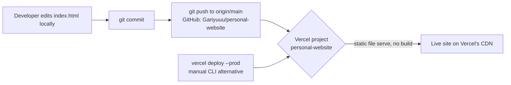
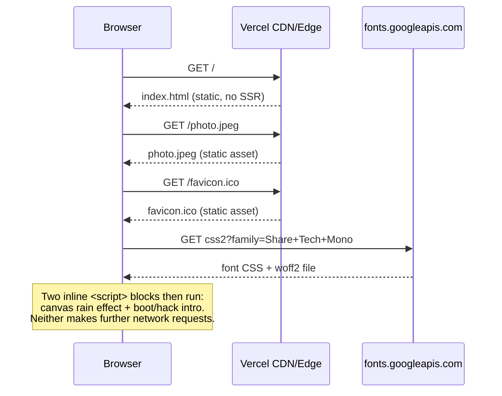

# ARCHITECTURE.md

## Summary

This is not an "application" in the architectural sense — it's a single
static HTML page. There is no server-side logic, no build pipeline, and
no client-side framework. The entire "architecture" is: one file,
served as-is, by Vercel's static hosting.

- **No build step.** `index.html` is committed exactly as it's served —
  there is no compilation, bundling, minification, or transpilation
  between the source file in this repo and what a browser receives.
- **No framework/backend.** No React, no client-side router, no
  Node/Express/Next.js server process, no API routes, no serverless
  functions. Vercel serves `index.html`, `photo.jpeg`, and
  `favicon.ico` directly as static assets.
- **A small amount of vanilla JavaScript, added 2026-08-07.** Two
  inline `<script>` IIFEs at the end of `<body>`: a `<canvas>`-based
  "digital rain" background effect (runs continuously via
  `requestAnimationFrame`), and a scripted terminal boot/hack-intro
  sequence that plays once per page load and removes itself when done
  or skipped (click/keypress). Both are self-contained — no external
  JS libraries, no network calls, no data read from or written to the
  page's content. Most nav-anchor "interactivity" is still native
  browser behavior (`html { scroll-behavior: smooth; }`), not
  script-driven.
- **One external network dependency: Google Fonts.** `index.html`'s
  `<head>` preconnects to `fonts.googleapis.com`/`fonts.gstatic.com`
  and loads a stylesheet for the `Share Tech Mono` webfont. This is the
  only third-party request the page makes.
- **No database, no backend API calls.** See `DATABASE.md` and
  `API_REFERENCE.md` (the Google Fonts request above is a font/CSS
  asset load, not a programmatic API call).

## Deploy flow

Whether step C→D happens automatically (Vercel's GitHub integration
watching `main`) or requires the manual `vercel deploy --prod` path
(bottom of the diagram) is **Unverified** from within this repo — see
`DEPLOYMENT.md`.

## Request flow (runtime)

That's the entire runtime picture — a handful of static file/font
requests, then client-side-only script execution with no further
network activity.
