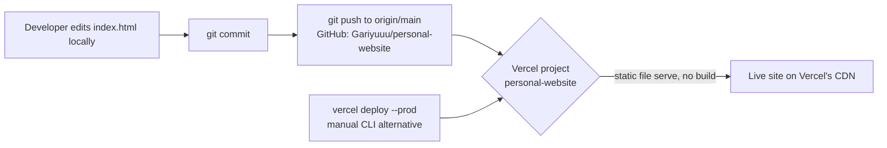
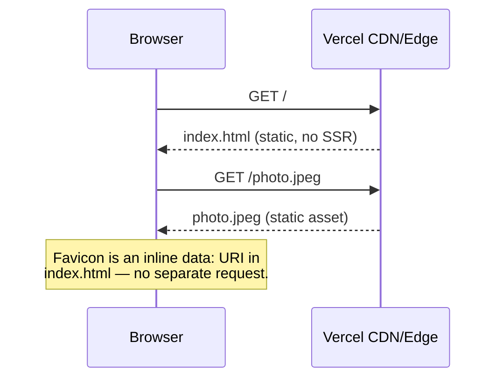

# ARCHITECTURE.md

## Summary

This is not an "application" in the architectural sense — it's a single
static HTML page. There is no server-side logic, no build pipeline, no
client-side framework, and no runtime state. The entire "architecture"
is: one file, served as-is, by Vercel's static hosting.

- **No build step.** `index.html` is committed exactly as it's served —
  there is no compilation, bundling, minification, or transpilation
  between the source file in this repo and what a browser receives.
- **No framework/runtime.** No React, no client-side router, no
  JavaScript at all. The only "interactivity" is native browser
  behavior: anchor-link scrolling (`html { scroll-behavior: smooth; }`)
  and `:hover` CSS states.
- **No server.** No Node/Express/Next.js server process, no API routes,
  no serverless functions. Vercel serves `index.html` and `photo.jpeg`
  directly as static assets.
- **No database, no external API calls.** See `DATABASE.md` and
  `API_REFERENCE.md`.

## Deploy flow

Whether step C→D happens automatically (Vercel's GitHub integration
watching `main`) or requires the manual `vercel deploy --prod` path
(bottom of the diagram) is **Unverified** from within this repo — see
`DEPLOYMENT.md`.

## Request flow (runtime)

That's the entire runtime picture — two static file requests, nothing
else.
